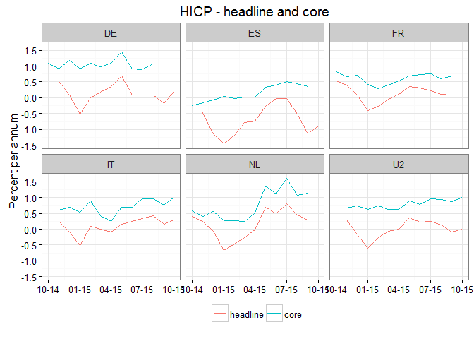

### Introduction

The `ecb` package package provides an `R` interface to the European Central Bank's Statistical Data Warehouse API.

To install the development version:

``` r
devtools::install_github("expersso/ecb")
```

### Example usage

``` r
library(ecb)

key <- "ICP.M..N.000000+XEF000.4.ANR"
filter <- list("lastNObservations" = 12)

hicp <- get_data(key, filter)

hicp <- subset(hicp, ref_area %in% c("DE", "FR", "ES", "IT", "NL", "U2"))

library(ggplot2)

ggplot(hicp, aes(x = obstime, y = obsvalue, color = icp_item)) +
  geom_line() +
  facet_wrap(~ref_area, ncol = 3) +
  scale_y_continuous(breaks = pretty_breaks(5)) +
  scale_x_date(date_labels = "%m-%y") +
  scale_color_discrete(labels = c("headline", "core")) +
  theme_bw() +
  theme(legend.position = "bottom") +
  labs(x = NULL, y = "Percent per annum", color = NULL,
       title = "HICP - headline and core")
```



### Disclaimer

This package is in no way officially related to or endorsed by the ECB.
