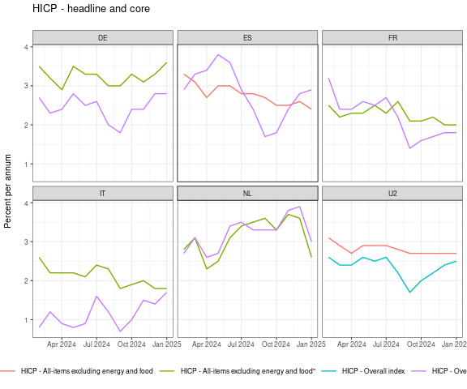
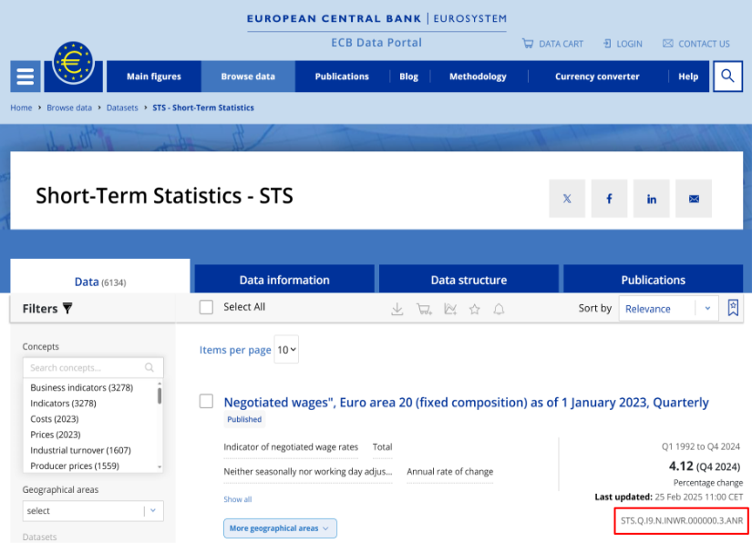
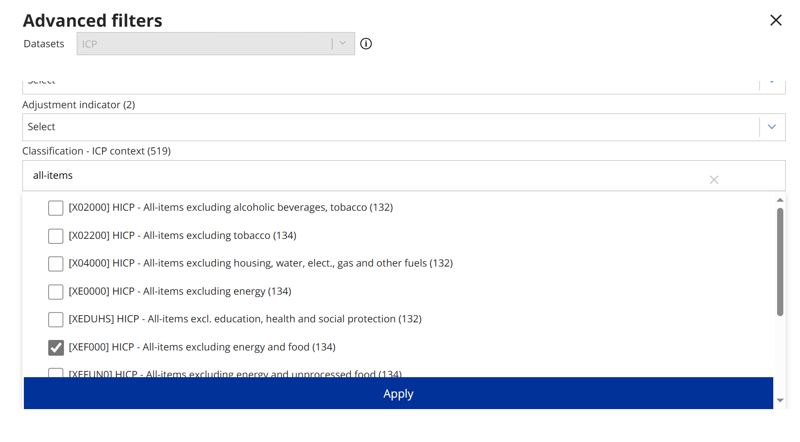
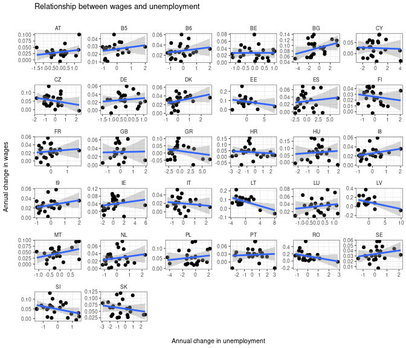

[](http://cran.r-project.org/package=ecb) [](https://travis-ci.org/expersso/ecb) [](https://codecov.io/github/expersso/ecb?branch=master) [](http://cran.r-project.org/package=ecb)

### Introduction

The `ecb` package package provides an `R` interface to the [European Central Bank's Statistical Data Warehouse](https://sdw.ecb.europa.eu/).

To install the development version:

``` r
library(devtools)
install_github("expersso/ecb")
```

### Example usage

The following example extracts the last twelve observations of headline and "core" HICP inflation for a number of countries available in the `ICP` database. See details below on how to use the `filter` parameter and how to find and use the SDW series keys.

``` r
library(ecb)
library(ggplot2)

key <- "ICP.M.DE+FR+ES+IT+NL+U2.N.000000+XEF000.4.ANR"
filter <- list(lastNObservations = 12, detail = "full")

hicp <- get_data(key, filter)

hicp$obstime <- convert_dates(hicp$obstime)

ggplot(hicp, aes(x = obstime, y = obsvalue, color = title)) +
  geom_line() +
  facet_wrap(~ref_area, ncol = 3) +
  theme_bw(8) +
  theme(legend.position = "bottom") +
  labs(x = NULL, y = "Percent per annum\n", color = NULL,
       title = "HICP - headline and core\n")
```

<!-- -->

### Details

#### The filter option

The `filter` option of `get_data()` takes a named list of key-value pairs. If left blank, it returns all data for the current version.

Available filter parameters:

-   `startPeriod` & `endPeriod`
    -   `YYYY` for annual data (e.g. 2013)
    -   `YYYY-S[1-2]` for semi-annual data (e.g. 2013-S1)
    -   `YYYY-Q[1-4]` for quarterly data (e.g. 2013-Q1)
    -   `YYYY-MM` for monthly data (e.g. 2013-01)
    -   `YYYY-W[01-53]` for weekly data (e.g. 2013-W01)
    -   `YYYY-MM-DD` for daily data (e.g. 2013-01-01)
-   `updatedAfter`
    -   A timestamp to retrieve the latest version of changed values in the database since a certain point in time
    -   Example: `filter = list(updatedAfter = 2009-05-15T14:15:00+01:00)`
-   `firstNObservations` & `lastNObservations`
    -   Example: `filter = list(firstNObservations = 12)` retrieves the first 12 observations of all specified series
-   `detail`
    -   Possible options: `full/dataonly/serieskeysonly/nodata`
    -   `dataonly` is the default
    -   Use `serieskeysonly` or `nodata` to list series that match a certain query, without returning the actual data
    -   An alternative to using `serieskeys/nodata` is the convenience function `get_dimensions()`, which returns a list of dataframes with dimensions and explanations (see extended example below).
    -   `full` returns both the series values and all metadata. This entails retrieving much more data than with the `dataonly` option.
-   `includeHistory` (not currently implemented)
    -   `false` (default) returns only version currently in production
    -   `true` returns version currently in production, as well as all previous versions

See the [SDW API](https://sdw-wsrest.ecb.europa.eu/) for more details.

#### Using SDW keys

The easiest way to find and learn more about SDW series key is to browse the [SDW website](https://sdw.ecb.europa.eu/). After finding the series one is interested in, and applying the relevant filters (frequency, geographic area, etc), one can just copy the key:



The SDW website also has provides all the necessary metadata, so it is much easier to explore data availability (in terms of available breakdowns, time periods, etc) directly on the website than it is to do it directly through the `ecb` package.

The `ecb` package supports using wildcards in the series key, which takes the form of simply leaving the wildcard dimension empty. For example, the key `ICP.M.DE.N.000000.4.ANR` retrieves HICP data for Germany (`DE`), while leaving the third dimension empty - `ICP.M..N.000000.4.ANR` - retrieves the same data for *all* available countries and country groups.

Instead of wildcarding, one can use the `+` operator to specify multiple values for a dimension. For example, `ICP.M.DE.N.000000+XEF000.4.ANR` retrieves both headline inflation (`000000`) and core inflation (`XEF000`). Learning that e.g. `XEF000` corresponds to core inflation would be done by browsing the SDW website:



To remind oneself of what different values for different dimensions mean, one can use the `get_dimensions)` function, which returns a list of dataframes:

``` r
dims <- get_dimensions("ICP.M.DE.N.000000+XEF000.4.ANR")
head(dims[[1]], 8)
```

    ##               dim  value
    ## 1            FREQ      M
    ## 2        REF_AREA     DE
    ## 3      ADJUSTMENT      N
    ## 4        ICP_ITEM 000000
    ## 5 STS_INSTITUTION      4
    ## 6      ICP_SUFFIX    ANR
    ## 7        DECIMALS      1
    ## 8       UNIT_MULT      0

### Extended example

As a more extended example, we will retrieve data to plot the annual change in wages against the annual change in unemployment. [Economic theory](https://en.wikipedia.org/wiki/Phillips_curve) suggests a negative relationship between these two variables.

We start by retrieving the two series, using wildcards for the geographic area dimension:

``` r
unemp <- get_data("STS.A..N.UNEH.RTT000.4.AV3", 
                 filter = list(startPeriod = "2000"))

wages <- get_data("MNA.A.N..W2.S1.S1._Z.COM_HW._Z._T._Z.IX.V.N", 
                 filter = list(startPeriod = "2000"))

head(unemp)
```

    ##   freq ref_area adjustment sts_concept sts_class sts_institution
    ## 1    A       AT          N        UNEH    RTT000               4
    ## 2    A       AT          N        UNEH    RTT000               4
    ## 3    A       AT          N        UNEH    RTT000               4
    ## 4    A       AT          N        UNEH    RTT000               4
    ## 5    A       AT          N        UNEH    RTT000               4
    ## 6    A       AT          N        UNEH    RTT000               4
    ##   sts_suffix obstime obsvalue
    ## 1        AV3    2000     4.27
    ## 2        AV3    2001     4.02
    ## 3        AV3    2002     4.10
    ## 4        AV3    2003     4.38
    ## 5        AV3    2004     4.88
    ## 6        AV3    2005     5.30

``` r
head(wages)
```

    ##   freq adjustment ref_area counterpart_area ref_sector counterpart_sector
    ## 1    A          N       AT               W2         S1                 S1
    ## 2    A          N       AT               W2         S1                 S1
    ## 3    A          N       AT               W2         S1                 S1
    ## 4    A          N       AT               W2         S1                 S1
    ## 5    A          N       AT               W2         S1                 S1
    ## 6    A          N       AT               W2         S1                 S1
    ##   accounting_entry    sto instr_asset activity expenditure unit_measure
    ## 1               _Z COM_HW          _Z       _T          _Z           IX
    ## 2               _Z COM_HW          _Z       _T          _Z           IX
    ## 3               _Z COM_HW          _Z       _T          _Z           IX
    ## 4               _Z COM_HW          _Z       _T          _Z           IX
    ## 5               _Z COM_HW          _Z       _T          _Z           IX
    ## 6               _Z COM_HW          _Z       _T          _Z           IX
    ##   prices transformation obstime obsvalue
    ## 1      V              N    2000 76.67950
    ## 2      V              N    2001 78.19106
    ## 3      V              N    2002 80.03906
    ## 4      V              N    2003 81.76739
    ## 5      V              N    2004 83.08288
    ## 6      V              N    2005 85.37658

To get a human-readable description of a series:

``` r
desc <- head(get_description("STS.A..N.UNEH.RTT000.4.AV3"), 3)
strwrap(desc, width = 80)
```

    ## [1] "Estonia - Standardised unemployment, Rate, Total (all ages), Total (male and"   
    ## [2] "female); 3-year average; Eurostat; Neither seasonally nor working day adjusted,"
    ## [3] "percentage of civilian workforce"                                               
    ## [4] "Poland - Standardised unemployment, Rate, Total (all ages), Total (male and"    
    ## [5] "female); 3-year average; Eurostat; Neither seasonally nor working day adjusted,"
    ## [6] "percentage of civilian workforce"                                               
    ## [7] "Italy - Standardised unemployment, Rate, Total (all ages), Total (male and"     
    ## [8] "female); 3-year average; Eurostat; Neither seasonally nor working day adjusted,"
    ## [9] "percentage of civilian workforce"

We now join together the two data sets:

``` r
library(dplyr)
```

    ## 
    ## Attaching package: 'dplyr'

    ## The following objects are masked from 'package:stats':
    ## 
    ##     filter, lag

    ## The following objects are masked from 'package:base':
    ## 
    ##     intersect, setdiff, setequal, union

``` r
unemp <- unemp %>% select(ref_area, obstime, "unemp" = obsvalue)
wages <- wages %>% select(ref_area, obstime, "wage" = obsvalue)

df <- left_join(unemp, wages)
```

    ## Joining by: c("ref_area", "obstime")

``` r
head(df)
```

    ## Source: local data frame [6 x 4]
    ## 
    ##   ref_area obstime unemp     wage
    ##      (chr)   (chr) (dbl)    (dbl)
    ## 1       AT    2000  4.27 76.67950
    ## 2       AT    2001  4.02 78.19106
    ## 3       AT    2002  4.10 80.03906
    ## 4       AT    2003  4.38 81.76739
    ## 5       AT    2004  4.88 83.08288
    ## 6       AT    2005  5.30 85.37658

Finally, we plot the annual change in wages against the annual change in unemployment for all countries:

``` r
library(ggplot2)

df %>% 
  filter(complete.cases(.)) %>% 
  group_by(ref_area) %>% 
  mutate(d_wage = c(NA, diff(wage)) / lag(wage),
         d_unemp = c(NA, diff(unemp))) %>% 
  ggplot(aes(x = d_unemp, y = d_wage)) +
  geom_point() +
  facet_wrap(~ref_area, scales = "free") +
  theme_bw(8) +
  theme(strip.background = element_blank()) +
  geom_smooth(method = "lm") +
  labs(x = "\nAnnual change in unemployment", y = "Annual change in wages\n",
       title = "Relationship between wages and unemployment\n")
```

<!-- -->

At a first glance, most countries indeed seem to follow the prediction of a negative relationship between wages and unemployment.

### Disclaimer

This package is in no way officially related to, or endorsed by, the ECB.
