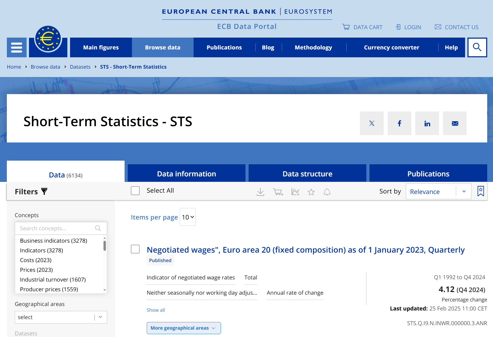
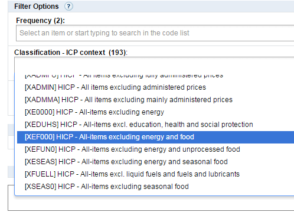

```{r options, echo=FALSE}
knitr::opts_chunk$set(fig.path = "", fig.width = 6, fig.height = 5, 
                      cache = FALSE, warning = FALSE)
```

### Introduction

The `ecb` package package provides an `R` interface to the [European Central Bank's Data Portal](https://data.ecb.europa.eu/).

### Example usage

The following example extracts the last twelve observations of headline and 
"core" HICP inflation for a number of countries available in the `ICP` database.
See details below on how to use the `filter` parameter and how to find and use
the EDP series keys.

```{r}
library(ecb)
library(ggplot2)
```

```{r hicp_plot, eval=FALSE}
key <- "ICP.M.DE+FR+ES+IT+NL+U2.N.000000+XEF000.4.ANR"
filter <- list(lastNObservations = 12, detail = "full")

hicp <- get_data(key, filter)

hicp$obstime <- convert_dates(hicp$obstime)

ggplot(hicp, aes(x = obstime, y = obsvalue, color = title)) +
  geom_line() +
  facet_wrap(~ref_area, ncol = 3) +
  theme_bw(8) +
  theme(legend.position = "bottom") +
  labs(x = NULL, y = "Percent per annum\n", color = NULL,
       title = "HICP - headline and core\n")
```

### Details

#### The filter option
The `filter` option of `get_data()` takes a named list of key-value pairs.
If left blank, it returns all data for the current version.

Available filter parameters:

* `startPeriod` & `endPeriod`
    * `YYYY` for annual data (e.g.: 2013)
    * `YYYY-S[1-2]` for semi-annual data (e.g.: 2013-S1)
    * `YYYY-Q[1-4]` for quarterly data (e.g.: 2013-Q1)
    * `YYYY-MM` for monthly data (e.g.: 2013-01)
    * `YYYY-W[01-53]` for weekly data (e.g.: 2013-W01)
    * `YYYY-MM-DD` for daily data (e.g.: 2013-01-01)
* `updatedAfter`
    * A timestamp to retrieve the latest version of changed values in the database since a certain point in time
   * Example: `filter = list(updatedAfter = 2009-05-15T14:15:00+01:00)`
* `firstNObservations` & `lastNObservations`
    * Example: `filter = list(firstNObservations = 12)` retrieves the first 12 observations of all specified series
* `detail`
    * Possible options: `full/dataonly/serieskeysonly/nodata`
    * `dataonly` is the default
    * Use `serieskeysonly` or `nodata` to list series that match a certain query, without returning the actual data
    * An alternative to using `serieskeys/nodata` is the convenience function `get_dimensions()`, which returns a list of dataframes with dimensions and explanations (see extended example below). 
    * `full` returns both the series values and all metadata. This entails retrieving much more data than with the `dataonly` option.
* `includeHistory` (not currently implemented)
    * `false` (default) returns only version currently in production
    * `true` returns version currently in production, as well as all previous versions

See the [EDP API](https://data-api.ecb.europa.eu/) for more details.

#### Using EDP keys

The easiest way to find and learn more about EDP series key is to browse the
[EDP website](https://data.ecb.europa.eu/). After finding the series one is
interested in, and applying the relevant filters (frequency, geographic area,
etc), one can just copy the key:



The EDP website also has provides all the necessary metadata, so it is much 
easier to explore data availability (in terms of available breakdowns, time 
periods, etc) directly on the website than it is to do it directly through the 
`ecb` package.

The `ecb` package supports using wildcards in the series key, which takes the 
form of simply leaving the wildcard dimension empty. For example, the key 
`ICP.M.DE.N.000000.4.ANR` retrieves HICP data for Germany (`DE`), while leaving 
the third dimension empty - `ICP.M..N.000000.4.ANR` - retrieves the same data 
for *all* available countries and country groups.

Instead of wildcarding, one can use the `+` operator to specify multiple values
for a dimension. For example, `ICP.M.DE.N.000000+XEF000.4.ANR` retrieves both
headline inflation (`000000`) and core inflation (`XEF000`). Learning that e.g.
`XEF000` corresponds to core inflation would be done by browsing the EDP
website:



To remind oneself of what different values for different dimensions mean, one
can use the `get_dimensions)` function, which returns a list of dataframes:

```{r get_dimensions_example}
dims <- get_dimensions("ICP.M.DE.N.000000+XEF000.4.ANR")
lapply(dims, head)
```

### Extended example

As a more extended example, we will retrieve data to plot the annual change in
wages against the annual change in unemployment. [Economic
theory](https://en.wikipedia.org/wiki/Phillips_curve) suggests a negative
relationship between these two variables.

We start by retrieving the two series, using wildcards for the geographic area
dimension:

```{r retrieve_data}

unemp <- get_data("LFSI.M..S.UNEHRT.TOTAL0.15_74.T", 
                 filter = list(startPeriod = "2000"))

wages <- get_data("MNA.A.N..W2.S1.S1._Z.COM_HW._Z._T._Z.IX.V.N", 
                 filter = list(startPeriod = "2000"))

head(unemp)
head(wages)
```

To get a human-readable description of a series:

```{r get_description_example}
desc <- head(get_description("LFSI.M..S.UNEHRT.TOTAL0.15_74.T"), 3)
strwrap(desc, width = 80)
```

We now join together the two data sets:

```{r join_data}
suppressPackageStartupMessages(library(dplyr))
suppressPackageStartupMessages(library(lubridate))

unemp <- unemp %>% 
  mutate(obstime = convert_dates(obstime)) %>% 
  group_by(ref_area, obstime = year(obstime)) %>% 
  summarise(obsvalue = mean(obsvalue)) %>%
  ungroup() %>% 
  select(ref_area, obstime, "unemp" = obsvalue)

wages <- wages %>% 
  mutate(obstime = as.numeric(obstime)) %>% 
  select(ref_area, obstime, "wage" = obsvalue)

df <- left_join(unemp, wages)
head(df)
```

Finally, we plot the annual change in wages against the annual change in
unemployment for all countries:

```{r phillips_plot, fig.width = 7, fig.height = 6}
library(ggplot2)

df %>% 
  filter(complete.cases(.)) %>% 
  group_by(ref_area) %>% 
  mutate(d_wage = c(NA, diff(wage)) / lag(wage),
         d_unemp = c(NA, diff(unemp))) %>% 
  ggplot(aes(x = d_unemp, y = d_wage)) +
  geom_point() +
  facet_wrap(~ref_area, scales = "free") +
  theme_bw(8) +
  theme(strip.background = element_blank()) +
  geom_smooth(method = "lm") +
  labs(x = "\nAnnual change in unemployment", y = "Annual change in wages\n",
       title = "Relationship between wages and unemployment\n")
```

### Disclaimer

This package is in no way officially related to, or endorsed by, the ECB.